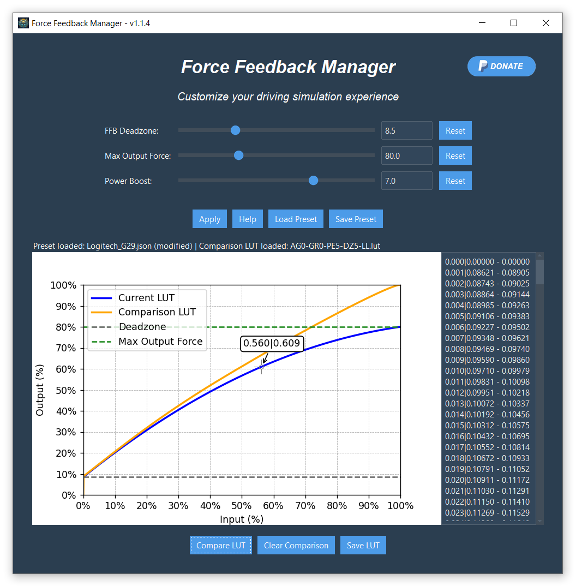

## Download

 - [***Force Feedback Manager***](https://github.com/Luke460/force-feedback-manager/releases) ***(latest version)***

## Rate & Donate

Donations are not required, but always accepted with pleasure. Thanks for your support!
 - [***Go to the donation page***](https://www.paypal.com/donate?hosted_button_id=WVSY5VX8TA4ZE)
 - [***User Feedback***](https://github.com/Luke460/force-feedback-manager/discussions/2)

## Other Applications

 - [***Steering Wheel Master:***](https://github.com/Luke460/steering-wheel-master) advanced force feedback tuning for every steering wheel.

---

# Force Feedback Manager
***Force Feedback Manager*** is designed to enhance and customize your driving simulation experience by optimizing force feedback settings, compensating for deadzones, and improving steering wheel performance. It offers an intuitive interface and essential features for driving enthusiasts.

The development was born to help the simracers community get the most out of their steering wheels, regardless of the price range of the hardware. While [***Steering Wheel Master***](https://github.com/Luke460/steering-wheel-master) (my previous application) was created with the same goal in mind, ***Force Feedback Manager*** aims to make the process even more straightforward and user-friendly. For more advanced features like calibration, please refer to ***Steering Wheel Master***.

***Force Feedback Manager*** is currently supported in ***Assetto Corsa*** and ***Assetto Corsa Competizione***.



## Features
### FFB Deadzone
This setting compensates and removes the force feedback deadzone of some steering wheels that are not properly calibrated. It recovers the small forces that would otherwise be lost in the friction of gears, belts, or the motor itself.

Tip: If set too high, vibrations may occur; reduce until they disappear. Increase until there's no more 'dead' feeling on straights.

### Max Output Force
This setting limits the maximum power in case the steering wheel has difficulty accurately reproducing forces near its power limit. In most cases, it can be set to the default value of 100%. Many games/simulators have this setting. If you want to use this setting, keep the game's default value (usually 100%).

Note: Exceeding 100% is not recommended as it will introduce clipping. Instead, use the Power Boost setting.

### Power Boost
This setting is beneficial for less powerful steering wheels to enhance the detail of weaker forces (which contain the most important force feedback information), gradually and progressively sacrificing stronger forces (such as strong impacts, pronounced bumps, which increase immersion but do not contain significant information). Some steering wheels have this setting integrated.

### LUT File
A LUT (Look-Up Table) is a reference table used in various applications and games to map input values of force feedback to customized output values. In other words, it allows the creation of a force feedback response curve that best fits the preferences and the hardware being used. By using a LUT, it is possible to achieve a more precise and realistic steering wheel response, correcting any inherent non-linearities of the device.

### Automatic Integration for Assetto Corsa and Assetto Corsa Competizione
A new option allows automatic creation and updating of the ff_post_process.ini file required by Assetto Corsa and Assetto Corsa Competizione.
When applying the LUT, the system generates the .ini file and automatically creates a backup if one doesn't already exist, ensuring previous configurations are safely preserved.
Note: If you're using Content Manager with Assetto Corsa, the LUT must be imported directly through Content Manager to be properly recognized in-game.

### Presets
These presets are intended as a starting point and should be fine-tuned to match your personal preferences.

| Brand & Model             | Drive Type        | Max Torque (Nm)      | FFB Deadzone (Estimated)  | Max Output Force | Power Boost |
|---------------------------|-------------------|----------------------|---------------------------|------------------|-------------|
| Logitech G29 / G920       | Gear-driven       | ~2.2                 | Moderate (~4–10%)         | 100              | 4.0         |
| Logitech G923             | Gear-driven       | ~2.3                 | Moderate (~4–10%)         | 100              | 4.0         |
| Logitech G Pro Racing     | Direct Drive      | ~11                  | Minimal (~0–2%)           | 100              | 0.0         |
| Thrustmaster T128         | Hybrid Drive      | ~2.5                 | Moderate (~6–12%)         | 100              | 3.5         |
| Thrustmaster T248         | Hybrid Drive      | ~3.5                 | Moderate (~6–10%)         | 100              | 2.5         |
| Thrustmaster T300 RS      | Belt-driven       | ~3.9                 | Low (~2–6%)               | 100              | 2.0         |
| Thrustmaster TX           | Belt-driven       | ~4.4                 | Low (~2–4%)               | 100              | 1.5         |
| Thrustmaster T-GT II      | Belt-driven       | ~6.0                 | Low (~1–3%)               | 100              | 1.0         |
| Thrustmaster T598         | Direct Drive      | ~8.0                 | None (~0–1%)              | 100              | 0.5         |
| Fanatec CSL DD (5Nm)      | Direct Drive      | ~5 / ~8 (Boost Kit)  | None (~0%)                | 100              | 0.5         |
| Fanatec DD1               | Direct Drive      | ~20                  | None (~0%)                | 100              | 0.0         |
| Fanatec DD2               | Direct Drive      | ~25                  | None (~0%)                | 100              | 0.0         |
| Moza R5                   | Direct Drive      | ~5.5                 | None (~0%)                | 100              | 0.5         |
| Moza R9                   | Direct Drive      | ~9                   | None (~0%)                | 100              | 0.0         |
| Simucube 2 Sport          | Direct Drive      | ~17                  | None (~0%)                | 100              | 0.0         |
| Simucube 2 Pro            | Direct Drive      | ~25                  | None (~0%)                | 100              | 0.0         |
| Cammus C5                 | Direct Drive      | ~5                   | None (~0–1%)              | 100              | 1.0         |
| Cammus C12                | Direct Drive      | ~12                  | None (~0–1%)              | 100              | 0.0         |

Suggested Power Boost general rule:

| Max Torque (Nm)	| Suggested Power Boost |
|-----------------|-----------------------|
| < 3 Nm	         | 4.0                   |
| < 4 Nm	         | 3.0                   |
| < 5 Nm	         | 2.0                   |
| < 8 Nm	         | 1.0                   |
| ≥ 10 Nm         |	Not needed            |

## How To Use
Follow these steps to create your custom LUT file with ***Force Feedback Manager:***

1) Launch the App:
   - To run ***Force Feedback Manager***, download the [***latest version***](https://github.com/Luke460/force-feedback-manager/releases), unzip the file and run ***ForceFeedbackManager.exe***.

2) Adjust the Sliders:
   - Use the sliders to adjust the main parameters (refer to the "Presets" section below):
     - FFB Deadzone: Compensates for deadzones in the force feedback.
     - Max Output Force: Limits the maximum force output to prevent distortion.
     - Power Boost: Enhances the sensitivity to finer details in the force feedback.

3) Apply Settings:
   - After adjusting the sliders, click on the "Apply" button to apply the settings and generate the LUT.

4) View the LUT:
   - The generated LUT will be displayed in the chart on the left, allowing you to see how the adjustments impact the force feedback behavior.
   - If you have a comparison LUT, you can load it to see the differences between the two curves.

5) Save the LUT:
   - Click on the "Save LUT" button to save the generated LUT to a .lut file.
   - Choose the location and name for the file, and confirm to complete the save process.

6) Use the LUT:
   - Follow the specific instructions provided in the documentation to use the LUT file in your simulation games, such as "Assetto Corsa" and "Assetto Corsa Competizione".

### ⚠️ Important Note
Sometimes, the *ForceFeedbackManager.exe* file may be flagged as a virus by some antivirus software. In such cases, you have 3 options:

 1) Add an exception in your antivirus software;

 2) Build the executable file yourself:
   - clone the repository
   - from *force-feedback-manager* folder run: 

     ``` pyinstaller --clean --onefile --windowed --version-file=version.txt src\ForceFeedbackManager.py ```

 3) Directly run the Python code from the command line, ensuring you have installed Python and the necessary libraries (as indicated by the imports at the top of the file). So, from *force-feedback-manager* folder run: 

   ``` python src\ForceFeedbackManager.py ```

### ⚠️ Before to start

In these procedures there is always a remote possibility of damaging your hardware. Only proceed if you are aware of the risk. I take no responsibility for any damage caused by this procedure.

## How to Use LUT Files in *Assetto Corsa* and *Assetto Corsa Competizione*

From version **1.2.0**, you no longer need to manually create the `ff_post_process.ini` file.
By enabling the option **“Create and update ff_post_process.ini file for Assetto Corsa and Assetto Corsa Competizione”**, the app will automatically generate and update the required configuration file whenever a LUT is applied.

### File Placement

Make sure both the `.lut` file and the automatically generated `.ini` file are placed in the correct folders:

- **Assetto Corsa**  
  `C:\Users\<user_name>\Documents\Assetto Corsa\cfg`

- **Assetto Corsa Competizione**  
  `C:\Users\<user_name>\Documents\Assetto Corsa Competizione\Config`

In *Assetto Corsa Competizione* the updated LUT is automatically reloaded when you open the **Controls** menu in-game, so no restart is required.

### ⚠️ Note for Content Manager Users (AC only)

If you're using **Content Manager** with Assetto Corsa, it's recommended to import the LUT directly through its interface.
Manual placement of the `.ini` file may be ignored by the game if not handled via Content Manager.

## How to use LUT files in *Assetto Corsa* with Content Manager

For Assetto Corsa, if you are using ***Content Manager*** as game launcher, you need to use its interface to set up your lut file as follows:


---
