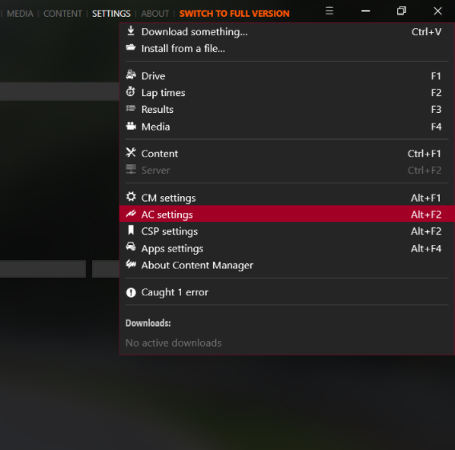
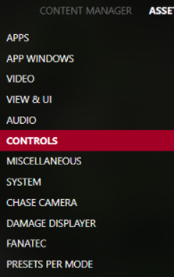
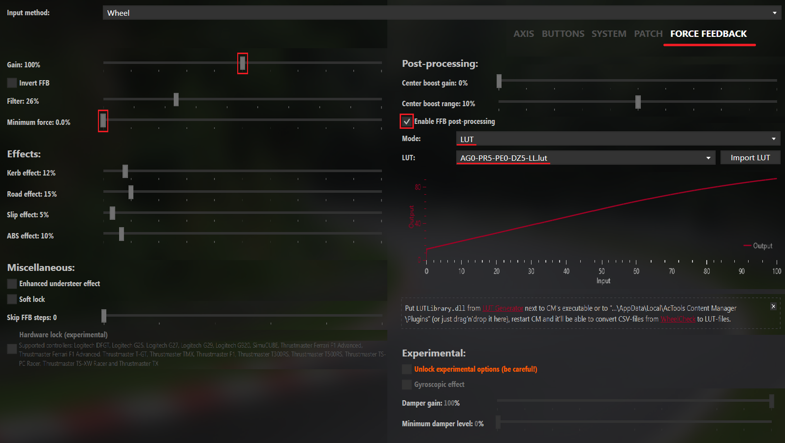

# Force Feedback Manager
Force Feedback Manager is a streamlined version of Steering Wheel Master, designed to enhance and customize your driving simulation experience. For more advanced features like calibration, please refer to [***Steering Wheel Master***](https://github.com/Luke460/steering-wheel-master).


## Features
### FFB Deadzone
This setting compensates and removes the force feedback deadzone of some steering wheels that are not properly calibrated. It recovers the small forces that would otherwise be lost in the friction of gears, belts, or the motor itself.

Tip: If set too high, vibrations may occur; reduce until they disappear. Increase until there's no more 'dead' feeling on straights.

### Max Output Force
This setting limits the maximum power in case the steering wheel has difficulty accurately reproducing force feedback near its power limit. In most cases, it can be set to the default value of 100%. Many games/simulators have this setting. If you want to use this setting, keep the game's default value (usually 100%).

Note: Exceeding 100% is not recommended as it will introduce clipping. Instead, use the Power Boost setting.

### Power Boost
This setting is beneficial for less powerful steering wheels to enhance the detail of weaker forces (which contain the most important force feedback information), gradually and progressively sacrificing stronger forces (such as strong impacts, pronounced bumps, which increase immersion but do not contain significant information). Some steering wheels have this setting integrated.

## How To Use
To run ***Force Feedback Manager***, download the [***latest version***](https://github.com/Luke460/force-feedback-manager /releases), unzip the file and run ***ForceFeedbackManager.exe***.

### Important Note
Sometimes, the *ForceFeedbackManager.exe* file may be flagged as a virus by some antivirus software. In such cases, you can:

 - Add an exception in your antivirus software.

 - Build the executable file yourself.

 - Directly run the Python code from the command line, ensuring you have installed Python and the necessary libraries (as indicated by the imports at the top of the file).

## Before to start

In these procedures there is always a remote possibility of damaging your hardware. Only proceed if you are aware of the risk. I take no responsibility for any damage caused by this procedure.

## How to use LUT files in *Assetto Corsa* and *Assetto Corsa Competizione*

To allow *AC* and *ACC* to use your lut file, you need to create a text file named *ff_post_process.ini*

Here is an example:
```
[HEADER]
VERSION=1
TYPE=LUT
ENABLED=1

[GAMMA]
VALUE=1

[LUT]
CURVE=NAME-OF-YOUR-LUT-FILE.lut
```
**NOTE:** You need to set the ***CURVE*** variable with the name of ***your*** LUT file.

Now just place both the .lut file and the .ini file in the following folder:
 - For AC: ```C:\Users\<user_name>\Documents\Assetto Corsa\cfg```
 - For ACC: ```C:\Users\<user_name>\Documents\Assetto Corsa Competizione\Config```

## How to use LUT files in *Assetto Corsa* with Content Manager

For Assetto Corsa, if you are using ***Content Manager*** as game launcher, you need to use its interface to set up your lut file as follows:





---
