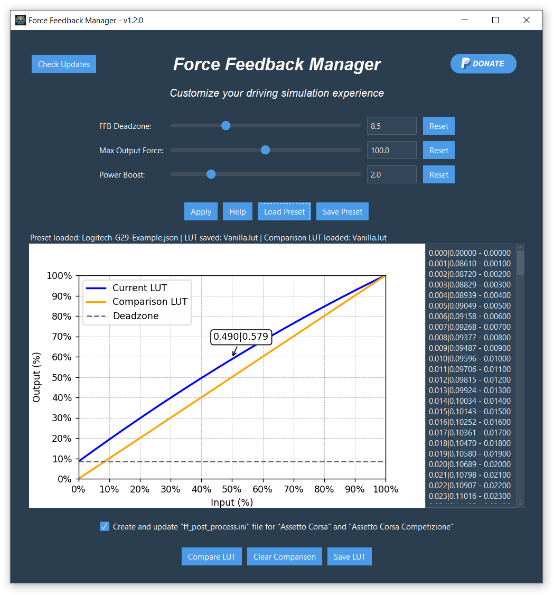

## Download

 - [***Force Feedback Manager***](https://github.com/Luke460/force-feedback-manager/releases) ***(latest version)***

## Rate & Donate

Donations are not required, but always accepted with pleasure. Thanks for your support!
 - [***Go to the donation page***](https://www.paypal.com/donate?hosted_button_id=WVSY5VX8TA4ZE)
 - [***User Feedback***](https://github.com/Luke460/force-feedback-manager/issues/1)

## Other Applications

 - [***Steering Wheel Master:***](https://github.com/Luke460/steering-wheel-master) advanced force feedback tuning for every steering wheel.

---

# Force Feedback Manager
***Force Feedback Manager*** is designed to enhance and customize your driving simulation experience by optimizing force feedback settings, compensating for deadzones, and improving steering wheel performance. It offers an intuitive interface and essential features for driving enthusiasts. 

The development was born to help the simracers community get the most out of their steering wheels, regardless of the price range of the hardware. While [***Steering Wheel Master***](https://github.com/Luke460/steering-wheel-master) (my previous application) was created with the same goal in mind, ***Force Feedback Manager*** aims to make the process even more straightforward and user-friendly. For more advanced features like calibration, please refer to ***Steering Wheel Master***.



## Features
### FFB Deadzone
This setting compensates and removes the force feedback deadzone of some steering wheels that are not properly calibrated. It recovers the small forces that would otherwise be lost in the friction of gears, belts, or the motor itself.

Tip: If set too high, vibrations may occur; reduce until they disappear. Increase until there's no more 'dead' feeling on straights.

### Max Output Force
This setting limits the maximum power in case the steering wheel has difficulty accurately reproducing force feedback near its power limit. In most cases, it can be set to the default value of 100%. Many games/simulators have this setting. If you want to use this setting, keep the game's default value (usually 100%).

Note: Exceeding 100% is not recommended as it will introduce clipping. Instead, use the Power Boost setting.

### Power Boost
This setting is beneficial for less powerful steering wheels to enhance the detail of weaker forces (which contain the most important force feedback information), gradually and progressively sacrificing stronger forces (such as strong impacts, pronounced bumps, which increase immersion but do not contain significant information). Some steering wheels have this setting integrated.

### LUT File
A LUT (Look-Up Table) is a reference table used in various applications and games to map input values of force feedback to customized output values. In other words, it allows the creation of a force feedback response curve that best fits the preferences and the hardware being used. By using a LUT, it is possible to achieve a more precise and realistic steering wheel response, correcting any inherent non-linearities of the device.


## How To Use
Follow these steps to create your custom LUT file with ***Force Feedback Manager:***

1) Launch the App:
   - To run ***Force Feedback Manager***, download the [***latest version***](https://github.com/Luke460/force-feedback-manager/releases), unzip the file and run ***ForceFeedbackManager.exe***.

2) Adjust the Sliders:
   - Use the sliders to adjust the main parameters:
     - FFB Deadzone: Compensates for deadzones in the force feedback.
     - Max Output Force: Limits the maximum force output to prevent distortion.
     - Power Boost: Enhances the sensitivity to finer details in the force feedback.

3) Apply Settings:
   - After adjusting the sliders, click on the "Apply" button to apply the settings and generate the LUT.

4) View the LUT:
   - The generated LUT will be displayed in the chart on the left, allowing you to see how the adjustments impact the force feedback behavior.
   - If you have a comparison LUT, you can load it to see the differences between the two curves.

5) Save the LUT:
   - Click on the "Save LUT" button to save the generated LUT to a .lut file.
   - Choose the location and name for the file, and confirm to complete the save process.

6) Use the LUT:
   - Follow the specific instructions provided in the documentation to use the LUT file in your simulation games, such as "Assetto Corsa" and "Assetto Corsa Competizione".

### Important Note
Sometimes, the *ForceFeedbackManager.exe* file may be flagged as a virus by some antivirus software. In such cases, you can:

 - Add an exception in your antivirus software;

 - Build the executable file yourself:
   - clone the repository
   - from *force-feedback-manager* folder run: 

     ``` pyinstaller --clean --onefile --windowed --version-file=version.txt src\ForceFeedbackManager.py ```

 - Directly run the Python code from the command line, ensuring you have installed Python and the necessary libraries (as indicated by the imports at the top of the file). So, from *force-feedback-manager* folder run: 

   ``` python src\ForceFeedbackManager.py ```

### Before to start

In these procedures there is always a remote possibility of damaging your hardware. Only proceed if you are aware of the risk. I take no responsibility for any damage caused by this procedure.

## How to use LUT files in *Assetto Corsa* and *Assetto Corsa Competizione*

To allow *AC* and *ACC* to use your lut file, you need to create a text file named *ff_post_process.ini*

Here is an example:
```
[HEADER]
VERSION=1
TYPE=LUT
ENABLED=1

[GAMMA]
VALUE=1

[LUT]
CURVE=NAME-OF-YOUR-LUT-FILE.lut
```
**NOTE:** You need to set the ***CURVE*** variable with the name of ***your*** LUT file.

Now just place both the .lut file and the .ini file in the following folder:
 - For AC: ```C:\Users\<user_name>\Documents\Assetto Corsa\cfg```
 - For ACC: ```C:\Users\<user_name>\Documents\Assetto Corsa Competizione\Config```

## How to use LUT files in *Assetto Corsa* with Content Manager

For Assetto Corsa, if you are using ***Content Manager*** as game launcher, you need to use its interface to set up your lut file as follows:


---
